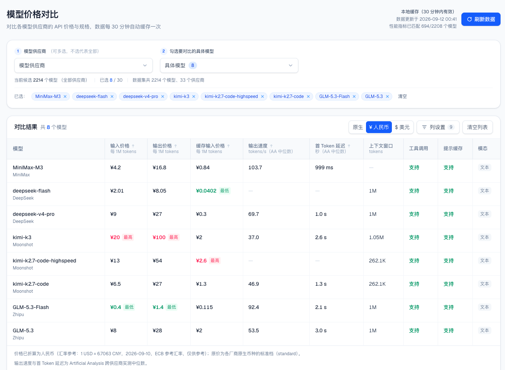

# 模型价格对比



一个用于横向对比各大模型供应商 API 价格、性能与规格的 Web 应用：支持供应商 / 模型两级筛选、数值列排序、价格极值高亮，以及人民币 / 美元汇率折算展示。

- 价格与规格数据来自 [LLMRates.ai](https://www.llmrates.ai) 开放数据集（CC BY 4.0）
- 性能指标（输出速度、首 Token 延迟）来自 [Artificial Analysis](https://artificialanalysis.ai/)（可选配置 API Key）
- 汇率参考 ECB（Frankfurter），折算结果仅供参考

## 快速开始

### 环境要求

- Node.js 20+
- pnpm（推荐，也可使用 npm / yarn / bun）

### 安装与启动

```bash
pnpm install
pnpm dev
```

打开 [http://localhost:3000](http://localhost:3000) 即可使用。

常用脚本：

| 命令         | 说明                   |
| ------------ | ---------------------- |
| `pnpm dev`   | 启动开发服务器         |
| `pnpm build` | 生产构建（含类型检查） |
| `pnpm start` | 启动生产服务器         |
| `pnpm lint`  | 运行 ESLint 检查       |

### 环境变量（可选）

在项目根目录的 `.env.local`（或 `.env`）中配置：

```bash
ARTIFICIAL_ANALYSIS_API_KEY=aa_你的key
```

| 变量                          | 必填 | 说明                                                                                                                                                                                                                                                                               |
| ----------------------------- | ---- | ---------------------------------------------------------------------------------------------------------------------------------------------------------------------------------------------------------------------------------------------------------------------------------- |
| `ARTIFICIAL_ANALYSIS_API_KEY` | 否   | [Artificial Analysis](https://artificialanalysis.ai/data-api) 免费 API Key（注册 Insights Platform 后生成）。配置后展示「输出速度」「首 Token 延迟」两列；未配置时两列显示 —，其余功能不受影响。免费层限 1,000 请求/日，本项目仅在服务端调用并做 12 小时缓存，实际用量远低于限额。 |

配置注意事项：

- Key 仅服务端使用（AA 条款要求），不会出现在浏览器请求中
- 修改环境变量后需**重启 dev server** 才会生效
- Next.js 环境变量文件优先级为 `.env.local` > `.env`，且**空值同样会覆盖**低优先级文件——同名变量务必只保留一处定义

## 缓存策略

价格数据在服务端经由数据源适配器转换为与数据源无关的领域模型（`lib/domain/types.ts`），再做磁盘缓存（6 小时 TTL，`.cache/pricing-catalog.json`，已加入 .gitignore），文件在进程内保留镜像、每个进程仅实际读取一次。未过期直接返回缓存，过期后向上游刷新；上游全部失败时降级返回过期数据。

数据源容灾链（`lib/server/sources/registry.ts`，按优先级逐个尝试）：

1. LLMRates.ai 动态 API（主源，原生币种、字段最全）
2. LLMRates GitHub 镜像（同一数据集，防单一端点故障）
3. [models.dev](https://models.dev)（独立第三方源，provider × model 结构与领域模型最接近）
4. [OpenRouter](https://openrouter.ai)（独立第三方源，公开 models API）

页面「刷新数据」按钮（`?force=1`）可强制绕过缓存重新拉取；`?source=<id>` 可强制使用指定数据源（容灾演练 / 排查用，不写缓存），如 `/api/pricing?source=modelsdev`。

## 项目结构

```
model_price_table_deepseek_2/
├── app/
│   ├── api/
│   │   ├── pricing/route.ts        # 价格数据代理（LLMRates.ai + GitHub 兜底）
│   │   ├── performance/route.ts    # 性能数据代理（Artificial Analysis）
│   │   └── fx/route.ts             # 汇率数据代理（ECB）
│   ├── globals.css
│   ├── layout.tsx
│   └── page.tsx
├── components/
│   ├── PriceCompareApp.tsx         # 主容器：取数、状态、筛选与持久化
│   ├── CompareTable.tsx            # 对比表格：排序、极值标签、币种渲染
│   ├── ColumnSettings.tsx          # 列显示设置
│   ├── ModelPicker.tsx             # 模型多选（二级筛选）
│   ├── ProviderFilter.tsx          # 供应商多选（一级筛选）
│   └── MultiSelect.tsx             # 通用多选下拉（搜索 + 虚拟滚动）
├── lib/
│   ├── domain/
│   │   └── types.ts                # 领域模型：与数据源无关的抽象数据结构
│   ├── server/
│   │   ├── sources/
│   │   │   ├── types.ts            # 数据源适配器契约
│   │   │   ├── shared.ts           # 适配器共享解析工具
│   │   │   ├── llmrates.ts         # LLMRates.ai 适配器（API 主源 + GitHub 镜像）
│   │   │   ├── models-dev.ts       # models.dev 适配器（独立备源）
│   │   │   ├── openrouter.ts       # OpenRouter 适配器（独立备源）
│   │   │   └── registry.ts         # 数据源注册表（容灾优先级）
│   │   ├── pricing-source.ts       # 价格数据编排：多源回退 + 磁盘缓存
│   │   ├── performance-source.ts   # 性能数据源：AA API + 匹配 + 内存缓存
│   │   ├── fx-source.ts            # 汇率数据源：ECB + 兜底 + 内存缓存
│   │   └── aa-matching.ts          # 领域模型 ↔ AA 多级模型匹配
│   ├── api.ts                      # 客户端取数与 IndexedDB 缓存
│   ├── cache.ts                    # IndexedDB 缓存封装
│   ├── metrics.ts                  # 列定义、格式化、币种换算
│   └── store.ts                    # localStorage 偏好持久化
└── ...
```
